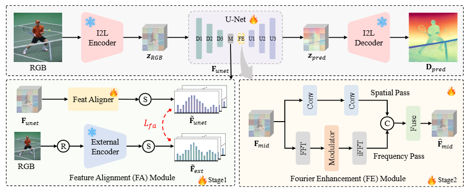

<!-- # DepthMaster: Taming Diffusion Models for Monocular Depth Estimation


This repository represents the official implementation of the paper titled "DepthMaster: Taming Diffusion Models for Monocular Depth Estimation". -->

<!-- [](https://marigoldmonodepth.github.io)
[](https://arxiv.org/abs/2312.02145) -->

<!-- [](https://www.apache.org/licenses/LICENSE-2.0) -->

<h1 align="center"><strong>DepthMaster: Taming Diffusion Models for Monocular Depth Estimation</strong></h1>
    <p align="center">
        <a href="https://indu1ge.github.io/ziyangsong">Ziyang Song*</a>,  
        <a href="https://orcid.org/0009-0001-6677-0572">Zerong Wang*</a>,
        <a href="https://orcid.org/0000-0001-7817-0665">Bo Li</a>,
        <a href="https://orcid.org/0009-0007-1175-5918">Hao Zhang</a>,
        <a href="https://ruijiezhu94.github.io/ruijiezhu/">Ruijie Zhu</a>,
        <a href="https://orcid.org/0009-0004-3280-8490">Li Liu</a>,
        <a href="https://pengtaojiang.github.io/">Peng-Tao Jiang†</a>,
        <a href="http://staff.ustc.edu.cn/~tzzhang/">Tianzhu Zhang†</a>,
        <br>
        *Equal Contribution, †Corresponding Author
        <br>
        University of Science and Technology of China, vivo Mobile Communication Co., Ltd.
        <br>
        <b>Arxiv 2025</b>
</p>
<!-- [Ziyang Song*](https://indu1ge.github.io/ziyangsong),
[Zerong Wang*](),
[Bo Li](https://orcid.org/0000-0001-7817-0665),
[Hao Zhang](https://orcid.org/0009-0007-1175-5918),
[Ruijie Zhu](https://ruijiezhu94.github.io/ruijiezhu/),
[Li Liu](https://orcid.org/0009-0004-3280-8490)
[Tianzhu Zhang](http://staff.ustc.edu.cn/~tzzhang/)
[Peng-Tao Jiang](https://pengtaojiang.github.io/) -->

<div align="center">
 <a href='https://arxiv.org/abs/2501.02576'></a> &nbsp;&nbsp;&nbsp;&nbsp;&nbsp;
<!-- <a href='https://arxiv.org/abs/[]'></a> &nbsp;&nbsp;&nbsp;&nbsp;&nbsp; -->
 <a href='https://indu1ge.github.io/DepthMaster_page/'></a> &nbsp;&nbsp;&nbsp;&nbsp;&nbsp;
 <a href='https://huggingface.co/zysong212/DepthMaster'></a> &nbsp;&nbsp;&nbsp;&nbsp;&nbsp;
 <a href='https://www.apache.org/licenses/LICENSE-2.0'></a> &nbsp;&nbsp;&nbsp;&nbsp;&nbsp;
 <!-- <a href='https://paperswithcode.com/sota/unsupervised-monocular-depth-estimation-on-7?p=ec-depth-exploring-the-consistency-of-self'></a> &nbsp;&nbsp;&nbsp;&nbsp;&nbsp; -->
</div>


<!-- We present Marigold, a diffusion model, and associated fine-tuning protocol for monocular depth estimation. Its core principle is to leverage the rich visual knowledge stored in modern generative image models. Our model, derived from Stable Diffusion and fine-tuned with synthetic data, can zero-shot transfer to unseen data, offering state-of-the-art monocular depth estimation results. -->




<!-- >We present DepthMaster, a tamed single-step diffusion model designed to enhance the generalization and detail preservation abilities of depth estimation models. Through feature alignment, we effectively prevent the overfitting to texture details. By adaptively enhance  -->
>We present DepthMaster, a tamed single-step diffusion model that customizes generative features in diffusion models to suit the discriminative depth estimation task. We introduce a Feature Alignment module to mitigate overfitting to texture and a Fourier Enhancement module to refine fine-grained details. DepthMaster exhibits state-of-the-art zero-shot performance and superior detail preservation ability, surpassing
other diffusion-based methods across various datasets.
## 📢 News
2025-01-15: Evaluation code is released. <br>
2025-01-02: [Paper](https://arxiv.org/abs/2501.02576) is released on arXiv. <br>
<!-- 2023-12-04: Added <a href="https://arxiv.org/abs/2312.02145"></a>
paper and inference code (this repository). -->

## Installation
Please refer to [installation.md](./docs/installation.md) for installation.

## Checkpoint
The model can be downloaded [here](https://huggingface.co/zysong212/DepthMaster).

## 🏃 Testing on your images

### 📷 Prepare images

Place your images in a directory, for example, under `in_the_wild_example/input`, and run the following inference command.

```bash
bash scripts/infer.sh
 ```


You can find all results in `in_the_wild_example/output`. Enjoy!


<!-- ### ⬇ Checkpoint cache

By default, the [checkpoint](https://huggingface.co/prs-eth/marigold-v1-0) is stored in the Hugging Face cache.
The `HF_HOME` environment variable defines its location and can be overridden, e.g.:

```bash
export HF_HOME=$(pwd)/cache
```

Alternatively, use the following script to download the checkpoint weights locally:

```bash
bash script/download_weights.sh marigold-v1-0
# or LCM checkpoint
bash script/download_weights.sh marigold-lcm-v1-0
```

At inference, specify the checkpoint path:

```bash
python run.py \
    --checkpoint checkpoint/marigold-v1-0 \
    --denoise_steps 50 \
    --ensemble_size 10 \
    --input_rgb_dir input/in-the-wild_example\
    --output_dir output/in-the-wild_example
``` -->

## 🦿 Evaluation on test datasets <a name="evaluation"></a>

Set data directory variable (also needed in evaluation scripts) and download [evaluation datasets](https://share.phys.ethz.ch/~pf/bingkedata/marigold/evaluation_dataset) following [Marigold](https://github.com/prs-eth/Marigold) into corresponding subfolders:

```bash
export BASE_DATA_DIR=<YOUR_DATA_DIR>  # Set target data directory

wget -r -np -nH --cut-dirs=4 -R "index.html*" -P ${BASE_DATA_DIR} https://share.phys.ethz.ch/~pf/bingkedata/marigold/evaluation_dataset/
```
Download the model [here](https://huggingface.co/zysong212/DepthMaster) to `ckpt/eval` subfolder.
Run evaluation scripts, for example:

```bash
bash scripts/eval_kitti.sh
```
The evaluation results will be saved to `output\kitti`.

## 🏋️ Training


Modify the data directory in `train_s1.sh` and `train_s2.sh`:

```bash
BASE_DATA_DIR=YOUR_DATA_DIR  # directory of training data
```

Prepare for [Hypersim](https://github.com/apple/ml-hypersim) and [Virtual KITTI 2](https://europe.naverlabs.com/research/computer-vision/proxy-virtual-worlds-vkitti-2/) datasets and save into `${BASE_DATA_DIR}` following [Marigold](https://github.com/prs-eth/Marigold?tab=readme-ov-file).


### The fist-stage training
Modify the checkpoint directory in `train_s1.sh`:

```bash
BASE_CKPT_DIR=YOUR_CHECKPOINT_DIR  # directory of pretrained checkpoint
```

Download Stable Diffusion v2 [checkpoint](https://huggingface.co/stabilityai/stable-diffusion-2) into `${BASE_CKPT_DIR}`.
\
Download the checkpoint of [Depth-Anything-V2](https://github.com/DepthAnything/Depth-Anything-V2) into `checkpoints/`

Run training script

```bash
bash scripts/train_s1.sh
```

### The fist-stage training
Modify the checkpoint directory in `train_s1.sh`:

```bash
BASE_CKPT_DIR=YOUR_FIRST_STAGE_CHECKPOINT_DIR  # directory of your fist-stage checkpoint checkpoint
```

Run training script

```bash
bash scripts/train_s2.sh
```


<!-- Evaluating results

Only the U-Net is updated and saved during training. To use the inference pipeline with your training result, replace `unet` folder in Marigold checkpoints with that in the `checkpoint` output folder. Then refer to [this section](#evaluation) for evaluation. -->


## 🎓 Citation

Please cite our paper:

```bibtex
@article{song2025depthmaster,
  title={DepthMaster: Taming Diffusion Models for Monocular Depth Estimation},
  author={Song, Ziyang and Wang, Zerong and Li, Bo and Zhang, Hao and Zhu, Ruijie and Liu, Li and Jiang, Peng-Tao and Zhang, Tianzhu},
  journal={arXiv preprint arXiv:2501.02576},
  year={2025}
}
```

## Acknowledgements

The code is based on [Marigold](https://github.com/prs-eth/Marigold).
\
The external encoder checkpoint is from [Depth-Anything-V2](https://github.com/DepthAnything/Depth-Anything-V2).

## 🎫 License

This work is licensed under the Apache License, Version 2.0 (as defined in the [LICENSE](LICENSE.txt)).

By downloading and using the code and model you agree to the terms in the  [LICENSE](LICENSE.txt).

[](https://www.apache.org/licenses/LICENSE-2.0)
